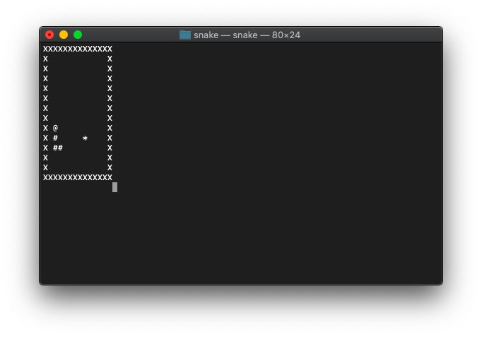

# snake game
Simple Snake Game C++11

Runs on Linux

# Background
I made this game over the course of ~ 1.5-2 days using only my intuition as to what a snake game should be like, and stack overflow for help with general C++ questions.  This was a mental exercise to see if I could make 'snake', without actually searching up, 'how to make a snake game'.

# Running
Navigate to the directory where you downloaded this repo, and run `make`.  From there you should just run `./snake` and the game will start.  Follow the prompts on screen.  Have fun!

https://youtu.be/TiYLkegC4pE

